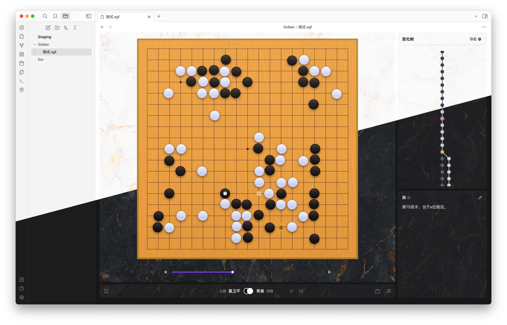

# Goban SGF for Obsidian

[简体中文](./README_CN.md)

**Goban SGF for Obsidian** is a plugin for managing Go game records in Obsidian, backed by the [SGF (Smart Game Format)](https://en.wikipedia.org/wiki/Smart_Game_Format). This plugin has ported and referenced most functionalities and the UI from [Sabaki](https://github.com/SabakiHQ/Sabaki) (excluding all engine and analysis-related features).

The purpose of this plugin is to assist friends learning Go. Now, they can use this plugin to study games and life-and-death problems in Obsidian, manage their game records as they would with regular notes, and make notes as they would when studying any other subject.

## Features
- Basic functionalities from [Sabaki](https://github.com/SabakiHQ/Sabaki), which can be referred to as **Sabaki-Lite**
  - Play Go: Supports multiple branches and variation trees
  - Edit: Allows adding various common markers
  - Comment
  - Free navigation
- Import and export of SGF game record files
- Flexible settings: the plugin has settings, and these can also be finely tuned to the file level (achieved through the frontmatter field)
- Support for displaying partial boards (useful for studying life-and-death problems)
- Support for rendering `sgf` format code blocks, meaning that `sgf` code blocks can be inserted into regular MD documents to render embedded read-only Go boards
- Supports UI in both light and dark modes

## How to
- Create a new Go game record file:
  - You can find an icon resembling a "Go stone" on the leftmost part of Obsidian; click it to create a new file
  - You can also find the option to create a new Go game record file through Obsidian's global command
  - Right-click on a folder in the sidebar and find "Create Go Game Record File" in the menu
- After creating a new Go game record:
  - If you have existing SGF format game records to import, you can immediately import them by clicking "Import SGF File" in the menu at the bottom left
  - You can play Go step by step, placing stones one by one
  - You can switch to "Edit Mode" at any time to mark the board and stones
  - You can open "Comment" editing at any time to add comments and good/bad move markers
- Navigation:
  - Navigate using the progress bar below the board
  - Navigate using the arrow keys on the keyboard
  - Navigate by scrolling the middle mouse button over the board
  - Drag and click on a variation point in the variation tree to navigate
  - Use the menu in the upper right corner of the variation tree for quick navigation to some marked points
- Save as a template:
  - After creating a new Go game record file, open the settings from the menu in the bottom left
  - After setting your default configurations, place the Go game record file into your Obsidian template folder
  - Next time you need the same configuration, you can use a plugin like **Templater** to automatically generate a new file based on that template, or you can manually copy it to create a new file

## Development
- Clone the code repository
- Run `pnpm install` to install dependencies
- Run `pnpm run dev` to watch for changes in the source code
- Make your Obsidian accessible to this plugin, **strongly recommended to use a development-specific empty Obsidian Vault** instead of your daily note-taking regular vault. This can be achieved by establishing a symbolic link.
- `ln -s /path/to/your/<plugin-repo> /path/to/your/obsidian/vault/.obsidian/plugins/<plugin-name>`

## Thanks
Special thanks to the [Sabaki](https://github.com/SabakiHQ/Sabaki) project and all the developers involved. Without you, I might have needed to do a tremendous amount of work to implement this plugin. Thank you for developing such an excellent Go tool and for being willing to open-source it.

## License
This project is licensed under the [MIT License](./LICENSE.md).

## Lang
The English, Korean, and Japanese in the project were all translated using translation tools. If there are any issues, feel free to point them out.